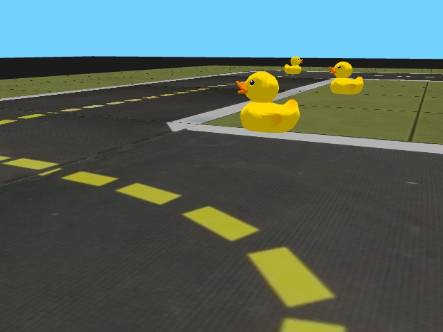

# Right Lane segmentation in Duckietown environment
Repository for project Duckietown at BME VIK (Budapesti Műszaki és Gazdaságtudományi Egyetem Villamosmérnöki és Informatikai Kar).

## Training, test, validation data for semantics segmentation
Original and annotated video frames can be extracted from gym_duckietown environment using the present scripts. By using these frames from the video files we plan to train, validate and test our network.

For more information on how the data collection and preprocessing was done, please refer to [this wiki page](https://github.com/timurlenk07/onlab_duckietown/wiki/Data-used-for-training,-testing-and-validating-the-network).

### Example training data
Data pair 1:

Data pair 2:

It is planned to extend both this description as well as the wiki pages.

## Segmentation network
All the code related to neural networks are implemented in PyTorch and, recently, in PyTorch Lightning.
Versions are always updated, so I plan to use the newest version possible.
If this repo is finalised, or I wish to make a tag of it then I will add specific version informations.

### Base architectures
I have tried a couple of segmentation networks that were:
- A custom network consisting of an encoder path and a decoder path, named EncDecNet among the models.
- FC-DenseNet, that offers less parameters with same accuracy. [Paper](https://arxiv.org/abs/1611.09326), code copied from [here](https://github.com/bfortuner/pytorch_tiramisu).

After some initial trials currently FC-DenseNet57 is in use.
It proved to be easy to train and also offered encouraging accuracy on real images without any domain adaptation technique applied.

### Domain adaptation
However good or encouraging was the result on the real image test it was still not good enough to apply it as a part of another system, to build on it.
So after some advice I tried Semi-Supervised Domain Adaptation with Minimax Entropy (short terms are SSDA MME) according to [this](https://arxiv.org/pdf/1904.06487.pdf) paper.
Fortunately the authors also publicised their own code written in PyTorch, found [here](https://github.com/VisionLearningGroup/SSDA_MME) and it is the current focus to apply the methods they have implemented.

With domain adaptation my hope is that the domain gap can easily be stepped over in this segmentation task.
